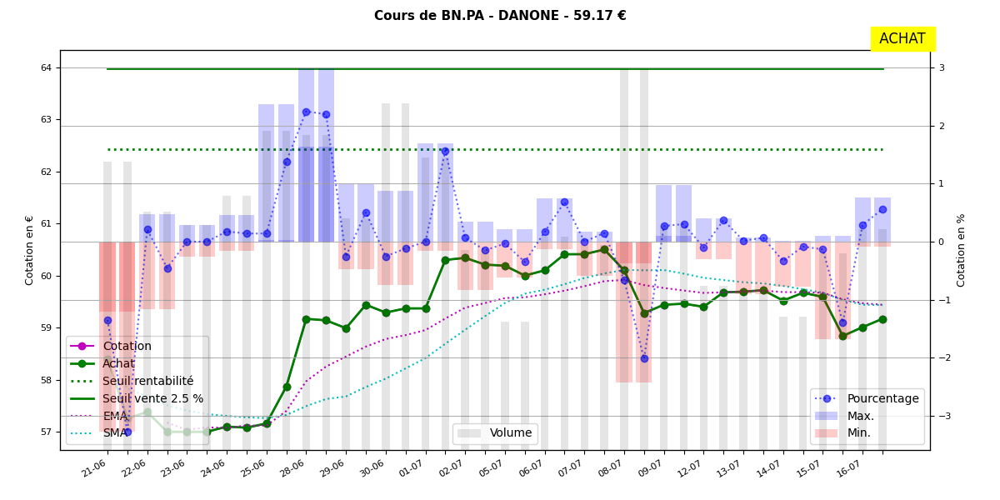

# PICSOU

Programme python3 
- pour récupérer le cours des actions en portefeuilles
- pour générer un graphique sur 30 jours

- pour récupérer le graphique d'investir.lesechos.fr

3 tables Sqlite :
- PTF : action en portefeuilles
- QUOTES : historiques du cours sur 30 jours paramétrables
- ORDERS : ordres d'achat et de vente

