# Guide PICSOU

## Les signaux des Chandeliers

#### Confirmation tendance haussière
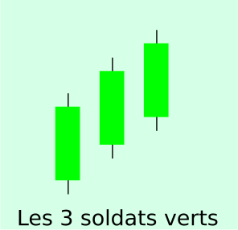
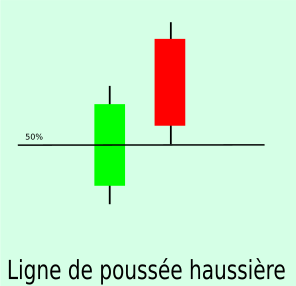

#### Atteinte de la résistance -> Vendre
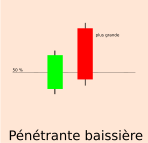
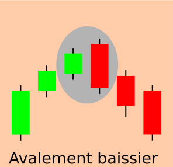
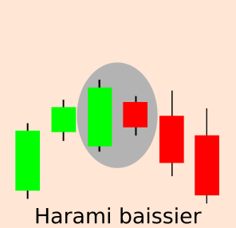
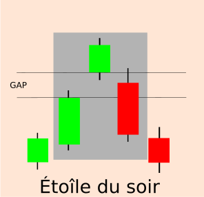

#### Confirmation tendance baissière
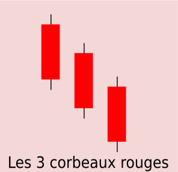
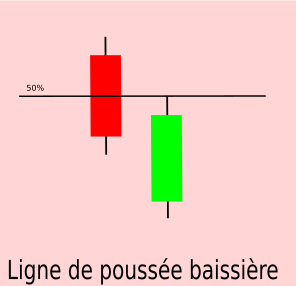

#### Atteint du support -> Acheter
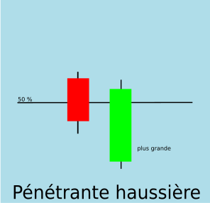
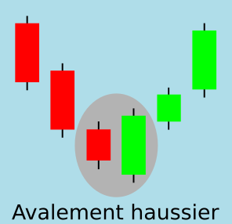
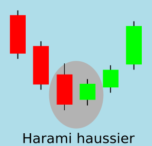
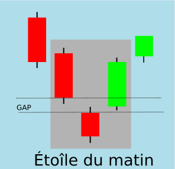

## Liens externes
- [Euro Stoxx 50 Cours des actions de l'indice - Investing.com](https://fr.investing.com/indices/eu-stoxx50-components)
- [Yahoo Finance](https://fr.finance.yahoo.com/)
- [Boursier.com](https://www.boursier.com/)
- [Bourse Direct](https://www.boursedirect.fr/fr/actualites)
- https://investir.lesechos.fr/cours/actions/sanofi-san-fr0000120578-xpar
- [Les chandeliers japonais - Figures à connaître](https://www.centralcharts.com/fr/gm/1-apprendre/7-analyse-technique/28-chandeliers-japonais)
- [11 figures chartistes à savoir pour tout débutant en Bourse](https://investir-en-actions.com/11-figures-chartistes-a-connaitre-pour-mieux-investir-en-bourse/)
- [4 indicateurs techniques à comprendre en Bourse](https://investir-en-actions.com/4-indicateurs-techniques-connaitre-bourse/)
